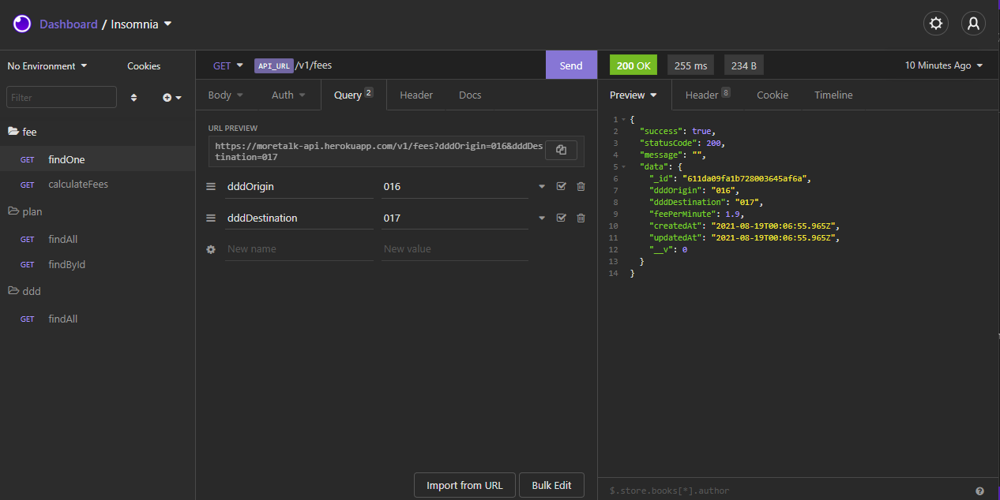

<p align="center">
  
</p>
<h2 align="center">📲 API para calcular as tarifas de ligações</h2>


Indice
=================
<!--ts-->
   * [Sobre](#Sobre)
   * [Features](#Features)
   * [Veja você mesmo](#veja-voce-mesmo)
   * [Pré-requisitos](#pre-requisitos)
   * [Rodando o Back End sem Docker](#run-sem-docker)
   * [Rodando o Back End com Docker](#run-com-docker)
   * [Documentação](#docs)
   * [Testes](#tests)
   * [Tecnologias](#tecnologias)
<!--te-->

### Sobre <a name="Sobre"></a>
 Falemais é uma plataforma que permite aos seus cliente calcularem de antemão as vantagens de se adquirir os melhores planos do mercado

### Features <a name="Features"></a>

- [x] Listagem de ddds
- [x] Listagem de Planos
- [x] Buscar por plano especifico
- [x] Buscar por tarifa especifico
- [x] Calculo do valor da tarifa com adesaão dos planos FaleMais

### Veja você mesmo <a name="veja-voce-mesmo"></a>

<p align="center">
  
</p>

Arquivo para importação no Insomnia: [Aqui](https://github.com/Joaoh3326/falemais/blob/master/public/json/Insomnia-All_2021-08-18.json)

### Pré-requisitos <a name="pre-requisitos"></a>

Antes de começar, você vai precisar ter instalado em sua máquina as seguintes ferramentas:
 1. [Node.js](https://nodejs.org/en/)
 2. [mongoDb](https://www.mongodb.com/pt-br) local ou [Atlas](https://www.mongodb.com/cloud/atlas) na nuvem
 3. [Docker](https://www.docker.com/) e [Docker Compose](https://docs.docker.com/compose/) (opcional)


Além disto é bom ter um editor para trabalhar com o código como [VSCode](https://code.visualstudio.com/)

### 🎲 Rodando o Back End sem Docker (servidor) <a name="run-sem-docker"></a>

```bash
# Clone este repositório ou baixe o projeto
$ git clone ...

# Acesse a pasta do projeto no terminal/cmd
$ cd falemais

# Instale as dependências
$ npm install

# Crie o arquivo .env para setar as variaves de ambiente
$ mkdir .env

# Abra o arquivo .env com o editor de sua preferencia
# e adicione duas variaves de ambiente
DB_HOST = <url do banco de dados>
PORT = <porta da aplicação> # Caso não seja passado vai rodar automaticamente na porta 3000

# Rode as seeds
npm run seed

# Execute a aplicação em modo de desenvolvimento
$ npm run dev

# O servidor inciará na porta:3000 - acesse <http://localhost:3000>
```

### 🎲 Rodando o Back End com Docker (servidor) (Opicional) <a name="run-com-docker"></a>
```bash
# Clone este repositório ou baixe o projeto
$ git clone ...

# Acesse a pasta do projeto no terminal/cmd
$ cd falemais

# Crie a imagem Docker do projeto
$ docker-compose build

# Inicie a aplicação
$ docker-compose up

# Acesse o container da aplicação
$ docker exec -it <id-container> sh

# Dentro do terminal do container rode as seeds
npm run seed

# Saia do container
$ exit

# O servidor inciará na porta:3000 - acesse <http://localhost:3000>
```

### 📜 Documentação (swagger)  <a name="docs"></a>
Não é possivel acessar a API quando esta rodando em produção

```bash
# Para acessar a documentação da api utilize a url
# Com o servidor rodando
$ http://localhost:3000/api-docs/
```

### 🧪 Testes <a name="tests"></a>

```bash
# Para rodar os testes unitarios
npm run test:unit

# Para rodar os testes de integração
npm run test:integration

# Para checar a corbertura de testes
npm run test:covarage
```

### 🛠 Tecnologias <a name="tecnologias"></a>

As seguintes ferramentas foram usadas na construção do projeto:

- [Node.js](https://nodejs.org/en/)
- [MongoDB](https://www.mongodb.com/pt-br)
- [Docker](https://www.docker.com/)

### Autor
---
 
 <br />
 <sub><b>João Henrique</b></sub>💪

👋🏽 Entre em contato!

 [](https://www.linkedin.com/in/jo%C3%A3o-henrique-gomes-6a20b6bb/)
[](joaoh3326@gmail.com)
